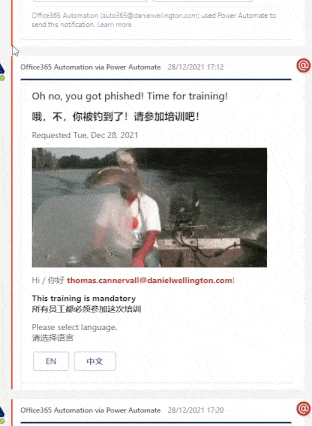
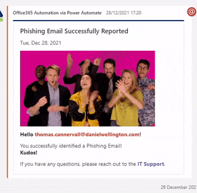

# Introduction

Here we will only briefly go through the steps that we are using aswell as an architectual overview due to the nature of medium articles. In our github repo we will present a more complete technical walkthrough on how to implement this. You can find this here

## Table of contents
* [Architectual Overview](#architectual-overview)
* [Description of steps when user gets phished](#description-of-steps-when-user-gets-phished)
* [Description of steps when user identifies a phishing attempt](#description-of-steps-when-user-identifies-a-phishing-attempt)

# Architectual Overview
<h3 align="center"></h3>

# Description of steps when user gets phished

1. A user recieves a Phishing Email sent by our training program
2. A user opens this email and fails to recognize that this is a phishing attempt and proceeds to click the link in that email
3. A user fails to recognize that the site they are sent to is not part of our usual login sites and submits their credentials
4. Gophish sends a webhook to Power Automatea. 
   1. We validate that this is a valid Gophish message using aws lambda and return valid or invalidb. 
   2. If valid we proceed to add the user to ongoing phishing training.c. 
   3. We also check if user has been phished before, regardless, their archive “score” is increased by 1
5. We send the initial phishing reminder both to teams and outlook. Which reminder is used depends on how many times a user has been phished. Recurring trapped users will get a different training form.

6. Here is an example of the teams message for the initial request to undergo training.

By selecting language you get further instructions

The next reminder date for the user is set to one week in the future

7. Every day we check for new reminders to be sent. With the users second reminder, their manager will get a copy of the notification.On the 4th reminder the managers manager is also informed. On the fifth reminder the user account is requested to be disabled by our support system Samanage using Azure automations.The support team informs the manager and then proceeds to disable the account.The manager must then contact support in order to unlock the account so that they can complete the training.

 8. (and 9) When a user completes the training the user is removed from the ongoing training list and any ongoing support ticket is updated to reflect this
 
# Description of steps when user identifies a phishing attempt

1. A user recieves a Phishing Email

2. A user correctly identifies the email to be a potential phishing attempt.4. A kudos message is sent back to the user. It looks like this

