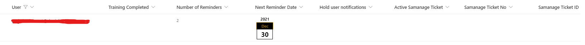
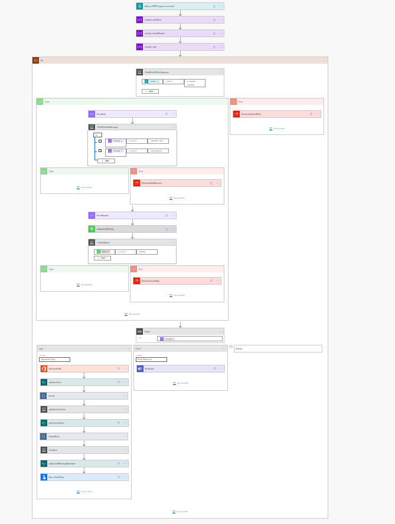
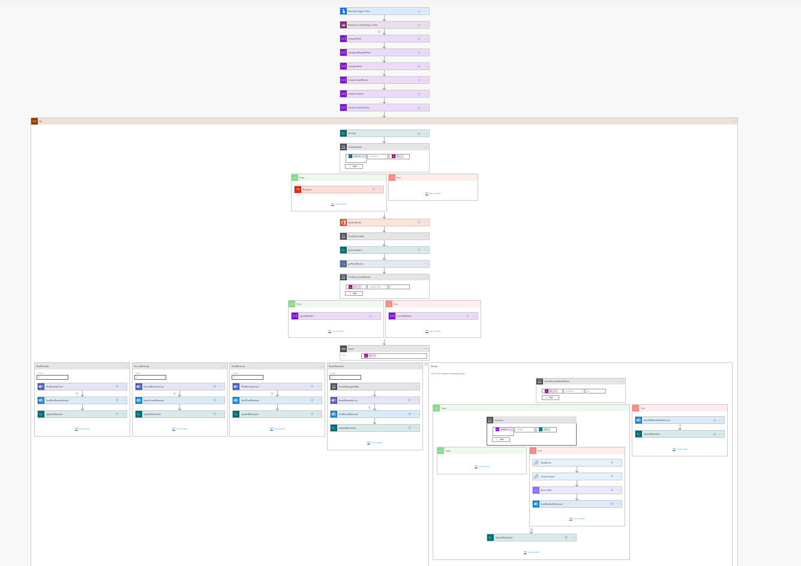
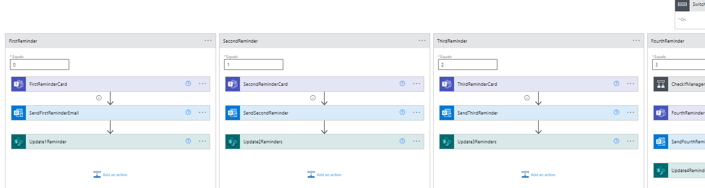
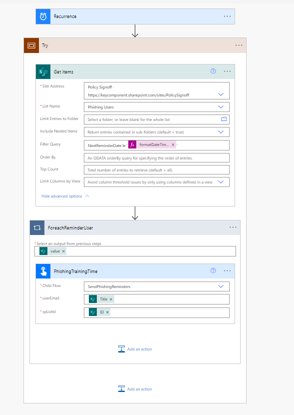
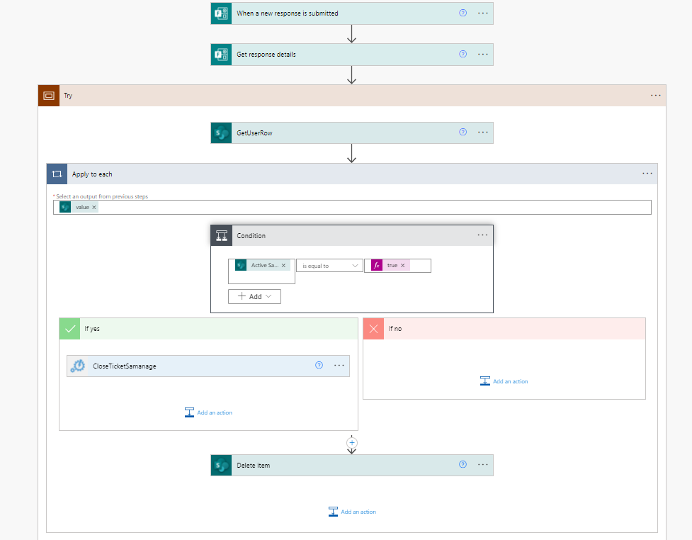

# Introduction

We needed a way to catch the users that got phished and also an automated way to send reminders to these users.
We have previously built some good concepts around Power Platform and using Sharepoint and Power Automate to handle policy reminders.
Do not expect a complete how-to here. This is how we have done it and what you can use.

## Table of contents
* [Architectual Overview](#architectual-overview)
* [Description of steps when user gets phished](#description-of-steps-when-user-gets-phished)
* [Description of steps when user identifies a phishing attempt](#description-of-steps-when-user-identifies-a-phishing-attempt)

# Architectual Overview

#  The Sharepoint Lists
To keep track of active users there are two lists involved

The list keeps track on 
    Active users 
    How many reminders the user have got so far
    If they are on hold
    If they have an active support ticket
## Users archive
The list keeps track of two things
    If a user has been phished historically
    How many times that user has been phished

# The Flows
## Part one, the gophish webhook
### Flow overview

### Description

So a few things. We wanted to catch the phished users but also send kudos when users successfully identified a phishing email. For this purpose we decided to use the [Gophish webhook}(https://docs.getgophish.com/user-guide/documentation/webhooks).

As for validating the webhook we use a Custom Connector in Power Automate to send a request to an Lambda in AWS to verify the request (X-Gophish-Signature) using go. We could do this on Azure but since a lot of our infrastructure in general is in AWS this was the simplest solution for us. On our github you can find the Gophish lambda, aswell as a swagger template for the Custom Connector. 

If the signature is validated then we check that the user is not already in the active period (sometimes gophish send multiple requests for the same submitted data). If not we add the users to the Phishing Users list in Sharepoint and also update the Archive list depending on how many times they have been phished before. 

As a final step of this flow we trigger a child flow to send the first reminder to the user

For reference here is the Kudos card! 

## Part two, send phishing reminder notifications

### Flow overview

### Description
So this flow might seem a bit intimidating at first glance so let us break this down into three parts. Validation of the user, Reminders and last but not least the Samanage Integration

Validation of User

When we say validation of user. Since this involves disabling of accounts we do have a validator for some users should be noted. It also verifies if manager value can be retrieved (the highest one on the food chain have no manager after all).
Users are also allowed to be put on hold (parental leave or similiar leave of abscence) which cancels the flow
As a last part of this we also validate how many times the user have been phished, this is because we send two different types of quizzes depending on that number.

Reminders

We have a switch depending on how many reminders a user has got so far

So this sends a teams notification using adaptive cards and also an email to the user.
Editors Note: Please note that send email will always trigger due to the fact that a user can block the bot conversation and will result in errors

Here is a card example of the first notification 

We have added an example card on our github that you can use if you need some inspiration

Samanage integration

Now I will only touch upon this but if the user has “failed” to complete the quiz / training within the given time, a support ticket to disable the user account is created. This is done using azure automations but could ofcourse be created in other ways.

On our github you can see a powershell example of this and the integration with our AD.

## Part three, The reccuring flows
There are two daily reccuring flows. One that checks if it is time to send reminders and one that updates support tickets to verify if the user has yet to complete the training. Here I will only go through the reminder flow

### Overview

### Description

It is a very straight forward flow. If the users next reminder date is less or equal to todays date, then they should recieve a new reminder

## Part four, Training completed

### Overview

### Description

Again a straight forward flow. Upon completing the requested training form the users are removed from the active users list. If there is a pending support ticket then this is updated with information that the user has completed the training.

